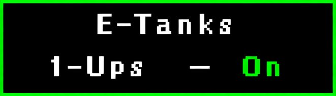

# Mega Man 3 Archipelago — PopTracker Pack

A [PopTracker](https://github.com/black-sliver/PopTracker) pack for the [Mega Man 3 Archipelago](https://archipelago.gg/) randomizer. Supports full autotracking via the Archipelago client and covers all check locations across both YAML configurations.

---

## Requirements

- [PopTracker](https://github.com/black-sliver/PopTracker/releases) v0.23.1 or later
- An [Archipelago](https://archipelago.gg/) server running the Mega Man 3 game

---

## Installation

1. Download the latest `.zip` from the [Releases](../../releases) page
2. Place the zip in your PopTracker `packs` folder:
   - **Windows:** `%appdata%\PopTracker\packs\`
   - **Linux/Mac:** `~/.config/PopTracker/packs/`
3. Launch PopTracker and select **Mega Man 3 Archipelago** from the pack list
4. Click the **AP** button and enter your server details to enable autotracking

---

## Features

- **Full autotracking** — items and locations sync automatically via Archipelago
- **22 map screens** — individual stage maps for all Robot Master stages, Doc Robot stages, and all 6 Wily Fortress stages, plus stage select overviews
- **115 check locations** tracked across all stages
- **Two YAML modes** supported via in-tracker settings toggles:
  - Default (bosses + weapons only)
  - Consumables enabled (E-Tanks, 1-Ups, Health Energy, Weapon Energy)
- **Settings Pop Out** — toggle E-Tanks/1-Ups and Energy Pickups on/off to match your YAML without leaving the tracker

---

## YAML Modes

### Default
Only boss defeats and weapon/Rush item pickups are checks. The energy and E-Tank location dots are hidden.

### Consumables Enabled
Activates additional check locations for:
- **E-Tanks** (up to 2 per Robot Master stage, up to 2 per Wily stage)
- **1-Ups** (Top Man, Doc Robot Needle, and select Wily stages)
- **Health Energy (L)** pickups per stage
- **Weapon Energy (L)** pickups per stage

Toggle these on in the **Settings Pop Out** (gear icon) to match your YAML:

| Icon | Setting | What it shows |
|------|---------|---------------|
|  | E-Tanks & 1-Ups | E-Tank and 1-Up check locations |
|  | Energy Pickups | Health and Weapon energy check locations |

---

## Tracker Layout

### Items Panel (left)
| Row | Contents |
|-----|----------|
| 1–3 | Robot Master portraits — grey (locked) → colour (stage accessible) → X (boss defeated) |
| 4–6 | 8 Robot Master weapons |
| 7 | Rush Coil, Rush Jet, Rush Marine |
| 8 | E-Tank counter · Break Man toggle |
| 9–10 | Doc Robot stage access toggles |

### Map Tabs (right)
| Tab | Contents |
|-----|----------|
| Stage Select | Main 8 Robot Master stage select screen |
| Doc Stage Select | Doc Robot stage select screen |
| Break Man | Break Man stage select screen |
| Robot Masters | Individual maps for all 8 Robot Master stages |
| Doc Robot | Individual maps for all 4 Doc Robot stages |
| Dr. Wily | Overview map + individual maps for Wily 1–6 |

---

## Stage Logic

- **Robot Master stages** unlock individually when the corresponding stage access item is received
- **Doc Robot stages** unlock when the corresponding Doc Robot stage access item is received
- **Break Man** unlocks after all 8 Robot Masters are defeated
- **Wily 1** unlocks after defeating Break Man
- **Wily 2–6** each unlock sequentially after clearing the previous Wily stage

---

## Credits

- Pack created for use with the [Mega Man 3 Archipelago](https://archipelago.gg/) world
- Built with [PopTracker](https://github.com/black-sliver/PopTracker)
- Sprites and stage map images from Mega Man 3 (NES, Capcom 1990)
